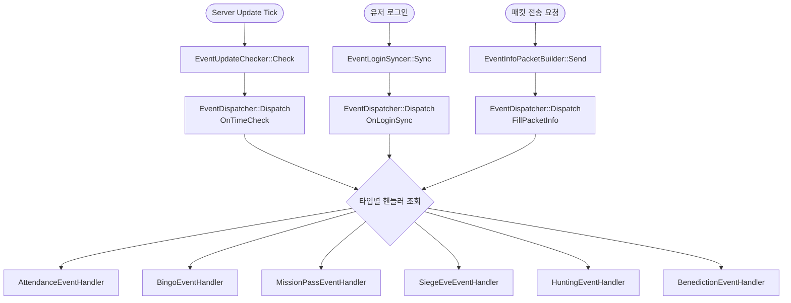
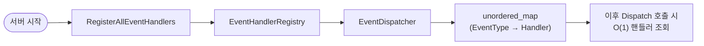

# GameEventSystem

게임 서버의 유저 이벤트 처리 시스템을 핸들러 패턴으로 리팩토링한 샘플 프로젝트입니다.

## 개발 배경

미르4 라이브 서비스를 진행하면서 이벤트 시스템을 지속적으로 확장해온 경험에서 출발했습니다.

초기 설계 시점에는 이벤트 타입 수가 제한적이었으나, 서비스가 성장하면서
출석·목표 달성·빙고·미션 패스·공성 전야제 등 다양한 이벤트가 지속적으로 추가되었습니다.
그 결과 초기의 switch-case 기반 구조가 비대해졌고,
버전별 조건 분기를 처리하기 위한 `#define` 플래그가 누적되면서 소스 복잡도가 점점 높아졌습니다.

새 이벤트 타입 하나를 추가하려면 서로 다른 역할을 가진 3개의 거대 함수를 동시에 수정해야 했고,
각 함수에 중복된 분기 로직이 혼재되어 사이드 이펙트를 파악하기 어려운 구조가 되었습니다.

이 문제를 해결하기 위해 핸들러 패턴 기반의 구조로 리팩토링한 것이 이 프로젝트입니다.

---

## 기존 구조의 문제

```
CheckUserEvent()       - 332줄  ┐
CheckEventLoginData()  - 305줄  ├ 이벤트 타입별 if-else 체인이 각 함수에 중복
SendUserEventInfo()    - 613줄  ┘
```

- 새 이벤트 타입 추가 시 위 3개 함수를 **동시에 수정**해야 함
- 타입별 로직이 거대한 함수 안에 혼재 → 코드 파악 난이도 증가
- 빙고처럼 추가 동작(보드 삭제)이 필요한 타입이 다른 타입 블록 안에 혼재
- 50개 이상의 `#define` 플래그로 데드코드가 누적된 구조

---

## 개선된 구조

```
GameEventSystem/
├── Core/
│   ├── EventType.h               이벤트 타입 enum 정의
│   ├── EventContext.h            핸들러 공통 컨텍스트
│   ├── IEventHandler.h           핸들러 인터페이스 (3개 메서드)
│   ├── EventDispatcher.h         타입-핸들러 매핑 및 디스패치
│   ├── EventHandlerRegistry.h/cpp 핸들러 등록 진입점
│   └── GameTypes.h               빌드 환경별 타입 선택
│
├── Handlers/
│   ├── AttendanceEventHandler    출석 계열 (8가지 타입 통합)
│   ├── BingoEventHandler         빙고 이벤트 (보드 삭제 포함)
│   ├── MissionPassEventHandler   미션 패스
│   ├── SiegeEveEventHandler      공성 전야
│   ├── HuntingEventHandler       사냥 이벤트
│   └── BenedictionEventHandler   복덕 이벤트
│
├── Update/
│   ├── EventUpdateChecker        CheckUserEvent 대체 (주기적 시간 체크)
│   ├── EventLoginSyncer          CheckEventLoginData 대체 (로그인 동기화)
│   └── EventInfoPacketBuilder    SendUserEventInfo 대체 (패킷 구성)
│
└── Test/
    ├── MockTypes.h               빌드용 Mock 타입 정의
    └── main.cpp                  테스트 33개
```

---

## 핵심 개선점

### 1. Open/Closed Principle 적용

새 이벤트 타입 추가 시 **기존 코드를 수정하지 않음**

```cpp
// Before: CheckUserEvent 332줄 함수 직접 수정
// After:  EventHandlerRegistry.cpp 에 한 줄만 추가
dispatcher.RegisterHandler(std::make_shared<NewEventHandler>());
```

### 2. 단일 책임 원칙 적용

| 기존 | 개선 | 역할 |
|------|------|------|
| `CheckUserEvent` (332줄) | `EventUpdateChecker` | 순회/디스패치만 담당 |
| `CheckEventLoginData` (305줄) | `EventLoginSyncer` | 로그인 동기화만 담당 |
| `SendUserEventInfo` (613줄) | `EventInfoPacketBuilder` | 패킷 구성만 담당 |
| 타입별 로직 인라인 혼재 | 각 `XxxEventHandler` | 타입별 독립 책임 |

### 3. 인터페이스 통일

모든 이벤트 핸들러가 동일한 3개의 메서드를 구현

```cpp
class IEventHandler {
    // 로그인 시 DB 데이터 동기화
    virtual bool         OnLoginSync   (const EventContext& ctx) = 0;
    // 주기적 시간 체크 (시작/종료/리셋)
    virtual HandleResult OnTimeCheck   (const EventContext& ctx) = 0;
    // 클라이언트 패킷 정보 구성
    virtual bool         FillPacketInfo(const EventContext& ctx, void* out) const = 0;
};
```
## 설계 트레이드오프

### 패턴 선택 이유

리팩토링 구조를 결정할 때 세 가지 패턴을 검토했습니다.

| 패턴 | 검토 결과 |
|---|---|
| **Visitor 패턴** | 이벤트 타입이 고정적일 때 유리하나, 타입이 지속적으로 추가되는 구조에서는 수정 범위가 오히려 넓어짐 |
| **Command 패턴** | 실행 단위를 객체화하기에 적합하나, 로그인 동기화/시간 체크/패킷 구성이라는 3가지 역할을 하나의 명령으로 묶기 어색함 |
| **Handler 패턴 (채택)** | 기존 3개 함수(`CheckUserEvent`, `CheckEventLoginData`, `SendUserEventInfo`)가 핸들러 인터페이스 3개 메서드로 자연스럽게 대응되어 기존 코드 흐름을 유지하면서 구조를 분리할 수 있었음 |

기존 코드와의 1:1 대응이 가능했던 점이 핵심 선택 이유였습니다.
실제 서버 코드베이스에 적용할 때 호출부 변경을 최소화할 수 있고,
팀원들이 기존 함수 흐름을 그대로 이해한 채로 새 구조에 적응할 수 있다는 점도 고려했습니다.

### 현재 구조의 한계

- 이벤트 핸들러가 항상 3개 메서드를 모두 구현해야 함 (일부 이벤트는 `OnLoginSync`가 불필요할 수 있음)
- 핸들러 간 공통 로직(예: 이벤트 기간 체크)이 중복될 경우 별도 Base 클래스 분리가 필요

---

## 아키텍처 흐름도
 
### 런타임 호출 흐름
 

 
### 서버 초기화 흐름
 

 
---

## 사용 예시

```cpp
// 서버 초기화 시 (한 번만 호출)
GameEvent::RegisterAllEventHandlers();

// 로그인 시 (CheckEventLoginData 대체)
GameEvent::EventLoginSyncer::Sync(zone_group, user);

// Update tick (CheckUserEvent 대체)
GameEvent::EventUpdateChecker::Check(now_tp, zone_group, user);

// 이벤트 정보 패킷 전송 (SendUserEventInfo 대체)
GameEvent::EventInfoPacketBuilder::Send(zone_group, user);
```

---

## 빌드 방법

### VS2017 이상
- C++ 언어 표준: `/std:c++17`
- 추가 포함 디렉터리: `$(ProjectDir)`
- 전처리기 정의: `GAME_EVENT_TEST`

---

## 테스트 항목 (TC 12개 / 검증 항목 33개)

TC 함수는 12개이며, TC1이 이벤트 타입 15개를 루프로 순회하기 때문에
실제 `CHECK()` 실행 횟수는 33번입니다.

| TC | CHECK 수 | 항목 |
|----|----------|------|
| TC1  | 15 | 핸들러 등록 확인 (이벤트 타입 15개 루프 검증) |
| TC2  | 3  | 미등록 타입 안전 처리 (TimeCheck / LoginSync / FillPacket) |
| TC3  | 1  | 출석 이벤트 종료 처리 |
| TC4  | 1  | 이미 삭제된 이벤트 종료 무시 |
| TC5  | 2  | 사냥 이벤트 기간 외 처리 (미래 / 과거) |
| TC6  | 1  | 사냥 이벤트 시작 전환 |
| TC7  | 1  | 미션 패스 신규 시작 |
| TC8  | 1  | 미션 패스 종료 처리 |
| TC9  | 1  | FillPacketInfo 호출 |
| TC10 | 3  | EventLoginSyncer / EventInfoPacketBuilder nullptr 안전 처리 |
| TC11 | 3  | 핸들러 미등록 타입 경계 확인 (BattlePass / Gacha / FullBanner) |
| TC12 | 1  | RepeatAttendance MaxStep 리셋 감지 |
| **합계** | **33** | |
