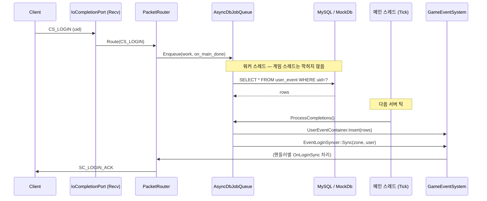
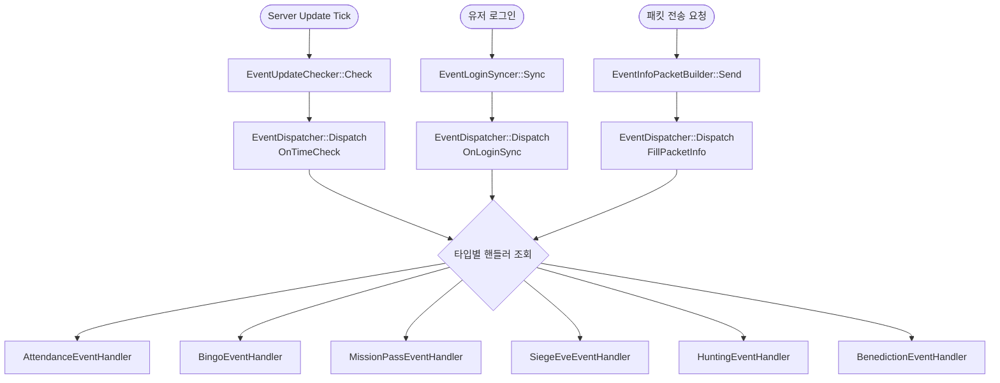

# GameEventSystem

게임 서버의 유저 이벤트 처리 시스템을 핸들러 패턴으로 리팩토링한 샘플 프로젝트입니다.

`Core` / `Handlers` / `Update`는 실제 서버 코드의 리팩토링 흐름을 그대로 옮긴 것이고,
`Network`(IOCP 기반 비동기 네트워크)와 `Persistence`(비동기 DB 처리)는 이 리팩토링 구조가
실제 서비스에서 어떻게 "네트워크 수신 → 비동기 DB 조회 → 이벤트 시스템 반영"으로
이어지는지 보여주기 위해 추가한 확장입니다.

## 개발 배경

미르4 라이브 서비스를 진행하면서 이벤트 시스템을 지속적으로 확장해온 경험에서 출발했습니다.

초기 설계 시점에는 이벤트 타입 수가 제한적이었으나, 서비스가 성장하면서
출석·목표 달성·빙고·미션 패스·공성 전야제 등 다양한 이벤트가 지속적으로 추가되었습니다.
그 결과 초기의 switch-case 기반 구조가 비대해졌고,
버전별 조건 분기를 처리하기 위한 `#define` 플래그가 누적되면서 소스 복잡도가 점점 높아졌습니다.

새 이벤트 타입 하나를 추가하려면 서로 다른 역할을 가진 3개의 거대 함수를 동시에 수정해야 했고,
각 함수에 중복된 분기 로직이 혼재되어 사이드 이펙트를 파악하기 어려운 구조가 되었습니다.

이 문제를 해결하기 위해 핸들러 패턴 기반의 구조로 리팩토링한 것이 이 프로젝트입니다.

---

## 기존 구조의 문제

```
CheckUserEvent()       - 332줄  ┐
CheckEventLoginData()  - 305줄  ├ 이벤트 타입별 if-else 체인이 각 함수에 중복
SendUserEventInfo()    - 613줄  ┘
```

- 새 이벤트 타입 추가 시 위 3개 함수를 **동시에 수정**해야 함
- 타입별 로직이 거대한 함수 안에 혼재 → 코드 파악 난이도 증가
- 빙고처럼 추가 동작(보드 삭제)이 필요한 타입이 다른 타입 블록 안에 혼재
- 50개 이상의 `#define` 플래그로 데드코드가 누적된 구조

---

## 개선된 구조

```
GameEventSystem/
├── Core/
│   ├── EventType.h               이벤트 타입 enum 정의
│   ├── EventContext.h            핸들러 공통 컨텍스트
│   ├── IEventHandler.h           핸들러 인터페이스 (3개 메서드)
│   ├── EventDispatcher.h         타입-핸들러 매핑 및 디스패치
│   ├── EventHandlerRegistry.h/cpp 핸들러 등록 진입점
│   └── GameTypes.h               빌드 환경별 타입 선택
│
├── Handlers/
│   ├── AttendanceEventHandler    출석 계열 (8가지 타입 통합)
│   ├── BingoEventHandler         빙고 이벤트 (보드 삭제 포함)
│   ├── MissionPassEventHandler   미션 패스
│   ├── SiegeEveEventHandler      공성 전야
│   ├── HuntingEventHandler       사냥 이벤트
│   └── BenedictionEventHandler   복덕 이벤트
│
├── Update/
│   ├── EventUpdateChecker        CheckUserEvent 대체 (주기적 시간 체크)
│   ├── EventLoginSyncer          CheckEventLoginData 대체 (로그인 동기화)
│   └── EventInfoPacketBuilder    SendUserEventInfo 대체 (패킷 구성)
│
├── Persistence/                  ── 비동기 DB 처리 (확장) ──
│   ├── DbTypes.h/cpp              DB_TEST 빌드 스위치 (MockDb ↔ MySQL)
│   ├── MockDb.h                   인메모리 Mock DB (테스트/포트폴리오 빌드)
│   ├── MySqlConnectionPool.h/cpp  MySQL C API 기반 커넥션 풀 (실서버 빌드)
│   ├── AsyncDbJobQueue.h/cpp      워커 스레드 + 메인 스레드 완료 큐
│   └── EventDbBridge.h/cpp        DB 로드 결과를 GameEventSystem에 반영
│
├── Network/                      ── 비동기 네트워크 (확장, Windows/IOCP) ──
│   ├── PacketDefs.h               패킷 헤더/오퍼코드
│   ├── IoContext.h                Overlapped I/O 컨텍스트
│   ├── Session.h/cpp              접속별 recv/send, TCP 스트림 재조립
│   ├── IoCompletionPort.h/cpp     IOCP 워커 스레드 풀
│   ├── PacketRouter.h/cpp         오퍼코드 → GameEventSystem 진입점 연결
│   └── NetworkServer.h/cpp        accept, Tick(서버 틱) 진입점
│
└── Test/
    ├── MockTypes.h               빌드용 Mock 타입 정의
    ├── main.cpp                  Core/Handlers/Update 테스트 33개 (VS, Windows)
    └── PersistenceTest.cpp       Persistence 계층 테스트 11개 (크로스플랫폼, g++)
```

---

## 핵심 개선점

### 1. Open/Closed Principle 적용

새 이벤트 타입 추가 시 **기존 코드를 수정하지 않음**

```cpp
// Before: CheckUserEvent 332줄 함수 직접 수정
// After:  EventHandlerRegistry.cpp 에 한 줄만 추가
dispatcher.RegisterHandler(std::make_shared<NewEventHandler>());
```

### 2. 단일 책임 원칙 적용

| 기존 | 개선 | 역할 |
|------|------|------|
| `CheckUserEvent` (332줄) | `EventUpdateChecker` | 순회/디스패치만 담당 |
| `CheckEventLoginData` (305줄) | `EventLoginSyncer` | 로그인 동기화만 담당 |
| `SendUserEventInfo` (613줄) | `EventInfoPacketBuilder` | 패킷 구성만 담당 |
| 타입별 로직 인라인 혼재 | 각 `XxxEventHandler` | 타입별 독립 책임 |

### 3. 인터페이스 통일

모든 이벤트 핸들러가 동일한 3개의 메서드를 구현

```cpp
class IEventHandler {
    // 로그인 시 DB 데이터 동기화
    virtual bool         OnLoginSync   (const EventContext& ctx) = 0;
    // 주기적 시간 체크 (시작/종료/리셋)
    virtual HandleResult OnTimeCheck   (const EventContext& ctx) = 0;
    // 클라이언트 패킷 정보 구성
    virtual bool         FillPacketInfo(const EventContext& ctx, void* out) const = 0;
};
```
## 설계 트레이드오프

### 패턴 선택 이유

리팩토링 구조를 결정할 때 세 가지 패턴을 검토했습니다.

| 패턴 | 검토 결과 |
|---|---|
| **Visitor 패턴** | 이벤트 타입이 고정적일 때 유리하나, 타입이 지속적으로 추가되는 구조에서는 수정 범위가 오히려 넓어짐 |
| **Command 패턴** | 실행 단위를 객체화하기에 적합하나, 로그인 동기화/시간 체크/패킷 구성이라는 3가지 역할을 하나의 명령으로 묶기 어색함 |
| **Handler 패턴 (채택)** | 기존 3개 함수(`CheckUserEvent`, `CheckEventLoginData`, `SendUserEventInfo`)가 핸들러 인터페이스 3개 메서드로 자연스럽게 대응되어 기존 코드 흐름을 유지하면서 구조를 분리할 수 있었음 |

기존 코드와의 1:1 대응이 가능했던 점이 핵심 선택 이유였습니다.
실제 서버 코드베이스에 적용할 때 호출부 변경을 최소화할 수 있고,
팀원들이 기존 함수 흐름을 그대로 이해한 채로 새 구조에 적응할 수 있다는 점도 고려했습니다.

### 현재 구조의 한계

- 이벤트 핸들러가 항상 3개 메서드를 모두 구현해야 함 (일부 이벤트는 `OnLoginSync`가 불필요할 수 있음)
- 핸들러 간 공통 로직(예: 이벤트 기간 체크)이 중복될 경우 별도 Base 클래스 분리가 필요

---

## 확장: 네트워크 계층과 비동기 DB 연동

### 왜 추가했는가

`EventLoginSyncer::Sync()`는 "유저 이벤트 데이터가 이미 메모리(`UserEventContainer`)에
로드되어 있다"는 것을 전제로 동작합니다. 하지만 실제 로그인 시퀀스에서는 그 전제를
만족시키기 위해 DB에서 `user_event` 테이블을 먼저 읽어와야 합니다. 이 조회를 게임
스레드에서 동기로 처리하면 로그인 처리 한 건 때문에 서버 틱 전체가 멎습니다.

`Network/`와 `Persistence/`는 그 앞뒤를 채운 것입니다. 클라이언트가 보낸 로그인 패킷이
네트워크 계층에 도착한 뒤, 비동기로 DB를 조회하고, 그 결과를 안전하게 메인 스레드에
반영한 다음에야 기존 `EventLoginSyncer::Sync()`가 호출되도록 연결했습니다.

### 스레드 경계가 핵심이다

이 확장에서 가장 신경 쓴 부분은 새 기능 자체가 아니라 **스레드 경계**입니다.

- IOCP 워커 스레드: 소켓 I/O만 담당
- DB 워커 스레드: 블로킹 DB 쿼리만 담당 (`AsyncDbJobQueue`)
- 메인(게임) 스레드: `CUser`, `UserEventContainer` 등 게임 상태를 만지는 코드는
  **반드시 여기서만** 실행 (`AsyncDbJobQueue::ProcessCompletions()`가 그 경계)

`AsyncDbJobQueue::Enqueue()`는 "워커에서 할 일"과 "메인 스레드에서 할 일"을 처음부터
분리해서 받기 때문에, 상위 코드(`EventDbBridge`)는 이 경계를 몰라도 자연스럽게 지키게
됩니다. `Test/PersistenceTest.cpp`의 TC1은 이 경계가 실제로 지켜지는지
(`ProcessCompletions()` 호출 전에는 게임 상태가 절대 바뀌지 않는지)를 직접 검증합니다.

### 로그인 시퀀스


```mermaid
sequenceDiagram
    participant C as Client
    participant IOCP as IoCompletionPort (Recv)
    participant R as PacketRouter
    participant Q as AsyncDbJobQueue
    participant DB as MySQL / MockDb
    participant M as 메인 스레드 (Tick)
    participant ES as GameEventSystem

    C->>IOCP: CS_LOGIN (uid)
    IOCP->>R: Route(CS_LOGIN)
    R->>Q: Enqueue(work, on_main_done)
    Note over Q,DB: 워커 스레드 — 게임 스레드는 막히지 않음
    Q->>DB: SELECT * FROM user_event WHERE uid=?
    DB-->>Q: rows
    Note over M: 다음 서버 틱
    M->>Q: ProcessCompletions()
    Q->>ES: UserEventContainer.Insert(rows)
    Q->>ES: EventLoginSyncer::Sync(zone, user)
    ES->>R: (핸들러별 OnLoginSync 처리)
    R->>C: SC_LOGIN_ACK
```

### 설계 트레이드오프 (네트워크/DB)

| 결정 | 검토한 대안 | 선택 이유 |
|---|---|---|
| IOCP | select/epoll류 이벤트 루프 | 국내 온라인 게임 서버가 대부분 Windows 기반이라, 완료 기반(completion-based) 모델과 커널 스레드풀을 그대로 활용할 수 있는 IOCP가 실서비스 환경과 가장 맞닿아 있음. 워커 스레드 수도 코어 수에 맞춰 그대로 활용 가능 |
| accept 전용 블로킹 스레드 | AcceptEx 완전 비동기 | 게임 서버는 패킷 처리량 대비 신규 접속 빈도가 훨씬 낮아, AcceptEx의 소켓 프리 생성/큐잉 복잡도를 감수할 이유가 적음. 접속 폭주 대응이 필요해지면 이 지점만 교체 |
| Job Queue + 메인 스레드 반영 | DB 콜백에서 바로 게임 상태 수정 | 콜백을 워커 스레드에서 바로 실행하면 게임 로직과 DB I/O가 같은 객체를 동시에 건드리는 레이스 컨디션이 생김. 반영 시점을 메인 스레드 틱으로 강제해 원천 차단 |
| DB_TEST 빌드 스위치 | 항상 실제 MySQL 필요 | `Core/GameTypes.h`가 이미 쓰던 패턴(`GAME_EVENT_TEST`)을 DB 계층에도 그대로 적용 — 리뷰어가 MySQL 서버 없이도 로직을 실행/검증할 수 있음 |

### 검증 범위 (정직하게 밝힙니다)

- **Persistence/** (DB 계층): 이 저장소를 작성한 환경에서 g++로 직접 컴파일하고
  **ThreadSanitizer**까지 통과시켜 검증했습니다 (`Test/PersistenceTest.cpp`, 11개 항목 전부 통과).
  실제 MySQL 연동(`MySqlConnectionPool`)은 로컬에 DB가 없어 컴파일 단위까지만 확인했습니다.
- **Network/** (IOCP 계층): Windows/Winsock2 전용 API라 이 저장소를 작성한 환경에서는
  컴파일 자체가 불가능해, Visual Studio로 직접 빌드해 확인하지는 못했습니다. API 사용법을
  최대한 정확히 지켜 작성했지만, 컴파일러가 바로 걸러줄 수준의 사소한 오탈자가 남아
  있을 가능성은 있습니다.

---

## 아키텍처 흐름도
 
### 런타임 호출 흐름
 

```mermaid
flowchart TD
    A([Server Update Tick]) --> B[EventUpdateChecker::Check]
    L([유저 로그인]) --> C[EventLoginSyncer::Sync]
    P([패킷 전송 요청]) --> D[EventInfoPacketBuilder::Send]
 
    B --> E[EventDispatcher::Dispatch\nOnTimeCheck]
    C --> F[EventDispatcher::Dispatch\nOnLoginSync]
    D --> G[EventDispatcher::Dispatch\nFillPacketInfo]
 
    E --> H{타입별 핸들러 조회}
    F --> H
    G --> H
 
    H --> I[AttendanceEventHandler]
    H --> J[BingoEventHandler]
    H --> K[MissionPassEventHandler]
    H --> L2[SiegeEveEventHandler]
    H --> M[HuntingEventHandler]
    H --> N[BenedictionEventHandler]
```
 
### 서버 초기화 흐름
 

```mermaid
flowchart LR
    A([서버 시작]) --> B[RegisterAllEventHandlers]
    B --> C[EventHandlerRegistry]
    C --> D[EventDispatcher]
    D --> E["unordered_map\n(EventType → Handler)"]
    E --> F["이후 Dispatch 호출 시\nO(1) 핸들러 조회"]
```
 
---

## 사용 예시

```cpp
// 서버 초기화 시 (한 번만 호출)
GameEvent::RegisterAllEventHandlers();

// 로그인 시 (CheckEventLoginData 대체)
GameEvent::EventLoginSyncer::Sync(zone_group, user);

// Update tick (CheckUserEvent 대체)
GameEvent::EventUpdateChecker::Check(now_tp, zone_group, user);

// 이벤트 정보 패킷 전송 (SendUserEventInfo 대체)
GameEvent::EventInfoPacketBuilder::Send(zone_group, user);
```

### 네트워크 + 비동기 DB 확장 사용 예시

```cpp
// 서버 초기화 시
GameEvent::RegisterAllEventHandlers();

GameNet::NetworkServer server;
server.Start(/*port=*/9000, /*io_worker_count=*/4);

// 메인 루프 (예: 100ms 주기)
while (running)
{
    server.Tick(); // DB 완료 반영 + EventUpdateChecker::Check 일괄 수행
    std::this_thread::sleep_for(std::chrono::milliseconds(100));
}

// CS_LOGIN 패킷 수신 시 내부적으로 아래 순서가 자동으로 일어남
//   1) PacketRouter::HandleLogin
//   2) GameDb::EventDbBridge::LoadUserEventsAsync (워커 스레드에서 DB 조회)
//   3) 다음 Tick()에서 ProcessCompletions() → UserEventContainer 반영
//   4) GameEvent::EventLoginSyncer::Sync(zone, user)
//   5) SC_LOGIN_ACK 응답 전송
```

---

## 빌드 방법

### VS2017 이상 (전체 프로젝트: Core/Handlers/Update/Network/Persistence)
- C++ 언어 표준: `/std:c++17`
- 추가 포함 디렉터리: `$(ProjectDir)`
- 전처리기 정의: `GAME_EVENT_TEST;DB_TEST`
  - `DB_TEST`를 빼면 `Persistence/MySqlConnectionPool.cpp`가 실제 MySQL C API
    (`mysql.h`)를 필요로 합니다. MySQL Connector/C 헤더 경로 추가 및
    `mysqlclient.lib` 링크가 필요합니다.
- `Network/` 코드는 Winsock2/IOCP를 사용하므로 Windows 빌드에서만 컴파일됩니다.
  라이브러리 링크(`Ws2_32.lib`, `Mswsock.lib`)는 `NetworkServer.cpp` 상단의
  `#pragma comment(lib, ...)`로 처리되어 있어 프로젝트 설정을 따로 건드릴 필요는
  없습니다.

### Persistence 계층만 별도 검증 (크로스플랫폼, g++)

`Network/`(Windows 전용)와 달리 `Persistence/`는 표준 C++만 사용해서, 아래 명령으로
리눅스/맥에서도 그대로 빌드·실행할 수 있습니다. 이 저장소는 이 명령으로 컴파일과
실행, 그리고 `-fsanitize=thread`(ThreadSanitizer)까지 통과한 상태입니다.

```bash
g++ -std=c++17 -DGAME_EVENT_TEST -DDB_TEST -I. -pthread \
    Test/PersistenceTest.cpp Persistence/AsyncDbJobQueue.cpp \
    Persistence/EventDbBridge.cpp Persistence/DbTypes.cpp \
    -o persistence_test
./persistence_test
```

---

## 테스트 항목

### Core/Handlers/Update — TC 12개 / 검증 항목 33개 (VS, Windows)

TC 함수는 12개이며, TC1이 이벤트 타입 15개를 루프로 순회하기 때문에
실제 `CHECK()` 실행 횟수는 33번입니다.

| TC | CHECK 수 | 항목 |
|----|----------|------|
| TC1  | 15 | 핸들러 등록 확인 (이벤트 타입 15개 루프 검증) |
| TC2  | 3  | 미등록 타입 안전 처리 (TimeCheck / LoginSync / FillPacket) |
| TC3  | 1  | 출석 이벤트 종료 처리 |
| TC4  | 1  | 이미 삭제된 이벤트 종료 무시 |
| TC5  | 2  | 사냥 이벤트 기간 외 처리 (미래 / 과거) |
| TC6  | 1  | 사냥 이벤트 시작 전환 |
| TC7  | 1  | 미션 패스 신규 시작 |
| TC8  | 1  | 미션 패스 종료 처리 |
| TC9  | 1  | FillPacketInfo 호출 |
| TC10 | 3  | EventLoginSyncer / EventInfoPacketBuilder nullptr 안전 처리 |
| TC11 | 3  | 핸들러 미등록 타입 경계 확인 (BattlePass / Gacha / FullBanner) |
| TC12 | 1  | RepeatAttendance MaxStep 리셋 감지 |
| **합계** | **33** | |

### Persistence — TC 4개 / 검증 항목 11개 (크로스플랫폼, g++ + ThreadSanitizer)

| TC | CHECK 수 | 항목 |
|----|----------|------|
| TC1 | 6 | 메인 스레드 반영 경계 (ProcessCompletions 호출 전/후 상태 검증) |
| TC2 | 2 | 신규 유저(DB에 데이터 없음) 처리 |
| TC3 | 1 | user == nullptr 방어 |
| TC4 | 2 | 유저 20명 동시 로그인 — 결과 교차 오염 없음 |
| **합계** | **11** | |

Network(IOCP) 계층은 실제 소켓 통신을 필요로 해 이 저장소만으로는 자동화된
단위 테스트를 구성하기 어렵다고 판단해 별도 테스트를 두지 않았습니다. 대신
코드 자체에 설계 의도와 각 분기의 이유를 주석으로 남겨, 리뷰 시 흐름을
따라가기 쉽도록 했습니다.
